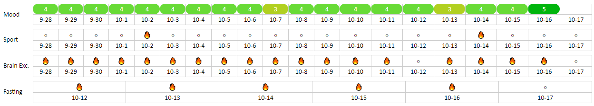

# Embeddable exist.io table

## URL Parameters

- key (Your Exist.io API Key, e.g. 519gqn9tosadgn...)

## Example URL
https://drandarov-io.github.io/embed-exist-io-table/docs/?key=509h0anta093b

## Examples

